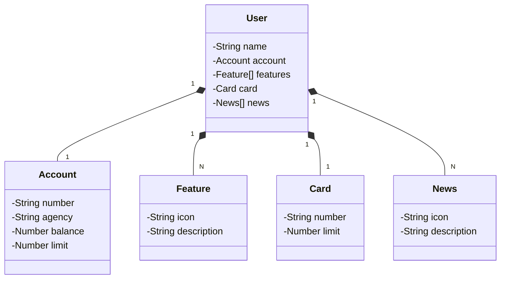

# santander-dev-week-2023
RESTFul API criada para a Santander Dev Week 2023 construída em Java 17 com Spring Boot 3.

## Principais Tecnologias Utilizadas
 - **Java 17**
 - **Spring Boot 3**
 - **Spring Data JPA**
 - **OpenAPI (Swagger)**
 - **Railway**

## Diagrama de Classes (Domínio da API)

